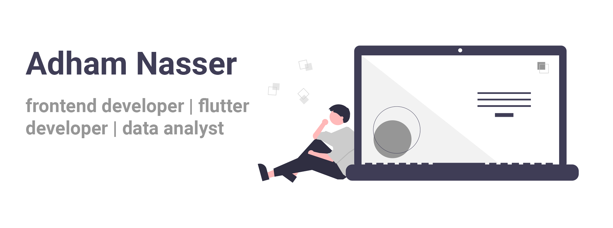

# 💫 About Me:

Hi there! 👋 I'm Adham Nasser, a front-end developer with a knack for crafting engaging experiences using React and Flutter. A proud graduate from Alexandria University with a degree in computer science, I fuel my curiosity with a dual passion for design and the vast realm of data science. 🚀

🎨 On the design front, I'm fascinated by the interplay of aesthetics and functionality. 💻In the data science realm, I'm sharpening my skills in Python, R, and SQL to unravel the mysteries of data.

In the coding arena, I wield JavaScript for seamless React development and Dart for the delightful world of Flutter. 🌐 Whether it's building responsive web applications or crafting beautiful mobile experiences, I bring creativity and precision to every line of code.

Beyond the screen, you'll find me with a cup of coffee in hand, savoring the rich blend of flavors. ☕️ I believe a good cup of coffee is the perfect companion to brainstorming and coding sessions. In my free time, I immerse myself in exciting coding projects, constantly seeking new challenges and learning opportunities.

Feel free to explore my coding adventures on GitHub, where I pour my passion into projects that reflect my commitment to quality and innovation. 🚀 Let's connect and chat tech, design, or anything that ignites your curiosity! 🌟

# 💻 Tech Stack:
<h3 align="left">Programming Languages:</h3>

 
  
   
   
  

<h3 align="left">Frontend Development:</h3>

 
 
   
   
   
  
  

<h3 align="left">Backend Development:</h3>

 
   
  

<h3 align="left">Mobile App Development:</h3>

 
   
  <a href="https://dart.dev/" target="_blank" rel="noreferrer"> 
     
  

<h3 align="left">Data Science and Visualization:</h3>

 
   
   
   
  

<h3 align="left">Design Tools:</h3>

 
   
  

<h3 align="left">Build Tools:</h3>

 
   

# 📊 GitHub Stats:
 
 

### ✍️ Random Dev Quote

---

<h3 align="left">Social:</h3>

 
   
   
  <!--  
   -->

